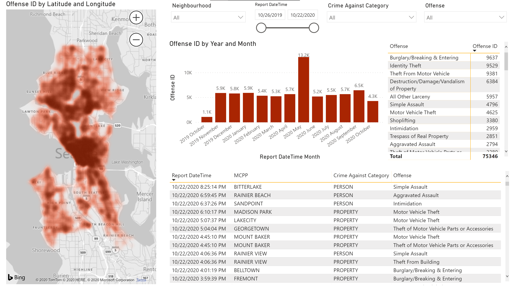

<head>
    
    
    
 </head>
 <body>

 </body>
<section class = "inner-medium">
 <h2>Power BI</h2>

  

    
  
Seattle Crime Trends

  

    
  
COVID-19 Progression by Country

<a class="prev" onclick="plusSlides(-1)">&#10094;</a>
<a class="next" onclick="plusSlides(1)">&#10095;</a>

 

   
   

</section>

 <section class = "inner-medium">
    
     
My first experience with Power BI was at my summer internship at Icertis - a contact management software as a service company. I got tasked to replace a whiteboard where people would sometimes update metrics relating to Marketing engagement with two TV screens showing several up to date dashboards. It was a great project where I could really learn by doing and implement new features as they were being released (such as Dataflows)

    
From that point onwards, everytime I have some question that can be answered with data one of the main tools I use is Power BI. Above you can see some example of projects where I have started with some curiosity and ended up with a dashboard

 
 </section>
